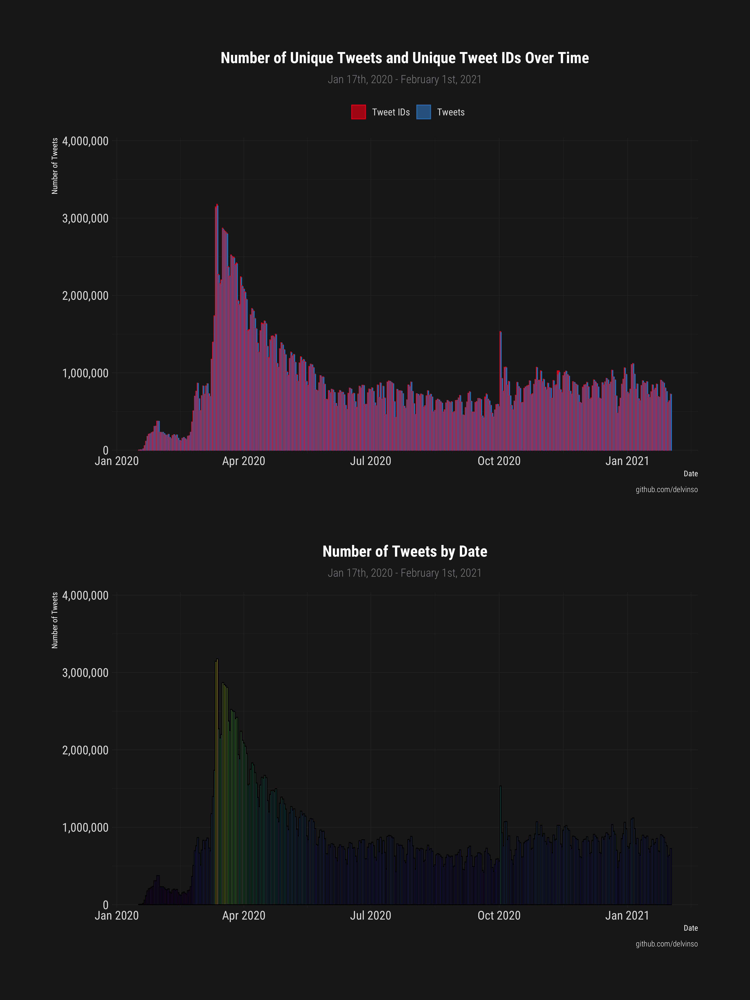
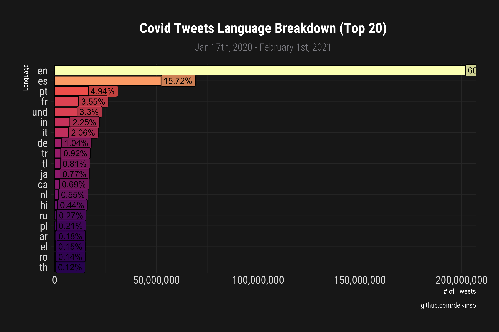

# covid19_one_hundred_million_unique_tweets

 Last Updated: August 23rd, 2020

## Data Description
_______________________

Tweets related to the coronavirus outbreak have been collected from Twitter's search API nightly since January 17th, 2020. As of 08/14/2020, there are now over 200 000 000 tweets!

Raw tweets are unable to be released, and per Twitter's [developer terms](https://developer.twitter.com/en/developer-terms/more-on-restricted-use-cases), only tweet IDs are available.

To faciliate research without having to hydrate every single tweet, the following have been generated and included in their respective folders, and will continue to be generated for **each day**:

- unigrams
- bigrams
- trigrams
- language counts
- hashtag counts

Statistics are generated by day allowing for mapping to say, a timeline, while also allowing for aggregate analyses.

Only the 95th percentile of n-gram counts are kept for each day. Partly due to GitHub file limitations, and partly to filter out junk.

NOTES: Tweets are **unique** in the sense that:
- There are no retweets, any retweets captured will be the 'conventional' retweet, ie. manually typing in 'RT @'.
- This will not pick up on a identical tweets which different in the shortened twitter link (considered spam?)
- Tweet IDs have been deduplicated, **by day**. It is possible there are overlap of tweets from the start of one day and the previous day.

## Statistics 

* As of 04/20/2020, over 100 000 000 **unique** tweets have been collected.
* 08/14/2020, broke 200 000 000 tweets.

Language Breakdown:

## Notes 
_______________

May 17, 2020

* January 17th - April 20th, broke 100 000 000 tweets
* On February 11th, the search query was changed to to include the official WHO designation of the virus as 'covid-19'.
* To better facilitate the pipelining process, python and thus tweepy was considered but after a few nights spent with the package, it did not appear to be utilizing the increased rate limit of a bearer token. Given the escalating situation and the corresponding increase in the number of tweets, I stuck with `rtweet`, which did honour the rate limit.

## Rehydrating Tweets
___________________________________ 

To obtain all metadata associated with a tweet, the tweet IDs need to be hydrated ie. the full tweet text and any metadata associated with it must be requested through Twitter's API using one of many available tools:

* [GUI] - [Hydrator](https://github.com/DocNow/hydrator)
    * One can combine several files before uploading a dataset for hydration, eg. `cat co19-*.csv > combined_tweet_ids.csv`
* [Python / CLI] - [twarc](https://github.com/DocNow/twarc)

## Known Gaps 
__________

* March 16th 00:00 - 07:00 UTC (dig through backups?)
* July 7th 00:00 - 05:00 UTC
* July 9th 00:00 - 10:00 UTC
* July 12th 00:00 - 10:00 UTC
* July 19th 00:00 - 10:15 UTC
* July 27th 00:00 - 05:00 UTC
* ~~July 30th 00:00 - 14:00 UTC~~
## Contact
__________

For any questions or suggestions please create an issue or contact me at so.delvin[ @ ] gmail [ dot ]com

## TODO
____________________
- tweets by coordinates, by day
- `floor_date` instead of `round_date`
- label tweet ids by language to allow for granular filtering

